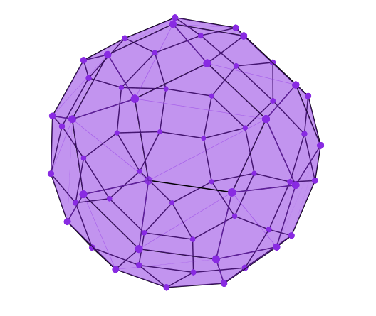
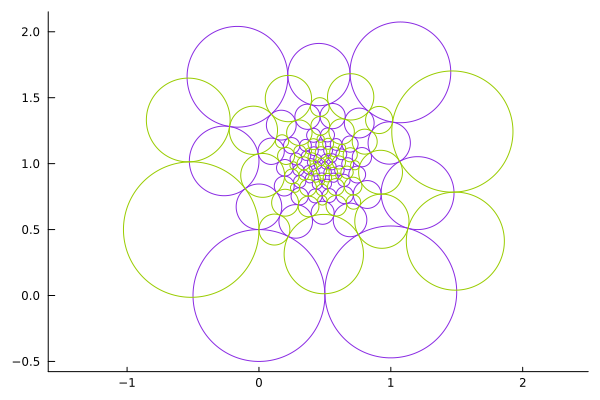

# Koebe Realizations

Given a $3$-dimensional polytope $P$, this code computes a numerical approximation of a realization of $P$ with edges tangent to the unit sphere and with barycenter centered at the origin. 
The algorithm is described in [Variational principles for circle patterns and Koebe's theorem](https://arxiv.org/abs/math/0203250).

This implementation is motivated by the paper [Algebraic Degrees of 3-Dimensional Polytopes](https://link.springer.com/article/10.1007/s10013-022-00559-2).

## Installation

```julia
using Pkg
Pkg.add(url="https://github.com/marabelotti/KoebeRealizations.jl.git")
```


## Constructing the realization
There are two ways of giving the polytope. 

#### Via vertex-facet incidence matrix
The first one is as the vertex-facet incidence matrix
```julia
using KoebeRealizations

cube = Bool[
    1 1 1 1 0 0 0 0
    1 1 0 0 1 1 0 0
    0 1 1 0 0 1 1 0
    0 0 1 1 0 0 1 1
    1 0 0 1 1 0 0 1
    0 0 0 0 1 1 1 1
]
koebe_realization(cube)
```
And this returns the matrix whose rows are the vertices of the realization.
```
8×3 Matrix{Float64}:
  0.316228  -0.707107   0.948683
 -0.948684  -0.707106   0.316228
 -0.316228  -0.707107  -0.948683
  0.948683  -0.707107  -0.316228
  0.316228   0.707107   0.948683
 -0.948683   0.707107   0.316228
 -0.316228   0.707107  -0.948683
  0.948683   0.707107  -0.316228
```

#### Via polytope

The input can also be a polytope from `Polymake.jl`. In this case the function also returns a polymake polytope.

```julia
using KoebeRealizations, Polymake

john73 = Polymake.polytope.johnson_solid(73)
K = koebe_realization(john73)
visual(K, FacetColor="0.54 0.17 0.89", VertexColor= "0.54 0.17 0.89", FacetTransparency=0.5)
```
<p align="center">
    
</p>

## Visualizing the circle packing

We can naturally associate to the realization a circle packing on the sphere by considering, for every vertex, the circle passing through the tangency points of the edges containing that vertex. 

This can be visualized, together with its dual, as follows:

```julia
using KoebeRealizations

john73 = Polymake.polytope.johnson_solid(73)
plot_circle_packing(john73)
```
<p align="center">
    
</p>

### Authors

Mara Belotti and Sascha Timme

